<!-- Header -->

<!--  -->

<!-- ### 🙇 안녕하세요, 환경을 개선하는 개발자 김기훈입니다! -->
**Backend Developer**
Java & Spring Boot · MSA · Performance Optimization · Concurrency Control
   
## 🧠 About Me

기술을 도입하는 것 자체보다, 기술 도입의 이유를 찾습니다.  
__"이 방법이 최선일까?"__라는 질문을 던지며 문제를 풀어가는 과정을 즐깁니다.    
대규모 트래픽과 동시성 이슈를 다루기 위해 Redisson 분산 락, Kafka/RabbitMQ 기반의 이벤트 기반 통신 구조를 설계하며 시스템의 병목을 객관적인 지표로 개선했고, 
굿즈샵의 대기열 문제(홈런티켓)나 물류 처리의 비효율(오잉 로지스틱스)처럼 **일상과 비즈니스의 명확한 불편함(Pain Point)을 찾아내고, 이를 소프트웨어의 구조적 최적화로 해소**하는 데 집중합니다.    
새로운 기술에 대한 두려움이 없습니다.  문제 해결을 위해서 Java 생태계에 안주하지 않고 DL4J를 활용한 AI 예측 모델 구축, PostGIS를 활용한 공간 데이터 처리 등 도구의 경계를 유연하게 넓혀갑니다.

## 📂 Projects

| Project | Description | Stack |
| :--- | :--- | :--- |
| **홈런티켓** *(KBO 티켓팅 플랫폼)* | **대규모 동시 접속 예매 및 대기열 처리 MSA 시스템** • **Redisson 분산 락**을 적용하여 대기열 신청 시 발생하는 데이터 경합 방지 및 정합성 유지 • **Testcontainers** 기반 격리된 통합 테스트 환경 및 **Prometheus/Grafana** 모니터링 체계 구축 | `Spring Boot`, `Kafka`, `Redis`, `GCP`, `Docker` |
| **오잉 로지스틱스** *(B2B 물류 MSA)* | **기업 간 주문-배송-재고 관리를 위한 이벤트 기반 플랫폼** • **RabbitMQ**를 활용해 서비스 간 의존성을 낮춘 비동기 데이터 동기화 구현 • **Redis(Global) + Caffeine(Local) 계층형 캐시** 적용으로 데이터 조회 병목 현상 개선 | `Spring Boot`, `RabbitMQ`, `Redis`, `PostgreSQL` |
| **배달의 구조** *(지역 배달 플랫폼)* | **위치 기반 검색에 최적화된 소상공인 주문 관리 서비스** • **PostGIS 공간 인덱싱**을 도입하여 거리 기반 상점 검색 쿼리 연산 속도 대폭 개선 • **QueryDSL**을 활용한 카테고리/거리 등 다중 동적 검색 로직 구현 | `Spring Boot`, `PostGIS`, `QueryDSL` |
| **재정 개조단** *(금융 추천 플랫폼)* | **투자 성향 분석 및 AI 금 시세 예측 의사결정 지원 플랫폼** • **DL4J 기반 LSTM 모델**을 학습시켜 자바 환경 내에서 직접 시세 예측 기능 구현 • 벡터 유사도 알고리즘 기반 금융 상품 추천 및 Vue.js 연동 풀스택 개발 | `Spring Boot`, `DL4J`, `Vue.js`, `MySQL` |

<!-- Body -->

### 🦾 Skills
**🧑‍💻 Lang and Frameworks**
<!-- Oracle의 요청으로 Java 로고가 Simple Icons에서 삭제되었기에 대신 OpenJDK의 로고를 사용 -->

<!--   -->

**📚 Databases**  

**🛠️ Infra and Tools**

  
<!--   -->

  
<!--  -->

  

## 💼 Experience & Education

| Organization | Role / Detail | Duration |
| :--- | :--- | :--- |
| **스파르타 KDT** | **AI 활용 백엔드 아키텍처 심화 과정** 대규모 트래픽 대응, MSA 보안 설계, EDA 아키텍처 및 시스템 모니터링 역량 심화 | 2025.02 – 2025.05 |
| **KB It’s Your Life 5기** | **웹 애플리케이션 개발자 과정** Vue.js 및 Spring Boot 기반 풀스택 인터랙션 구현 및 RDBMS 최적화 학습 | 2024.05 – 2024.10 |

<!-- | **공주대학교** | **컴퓨터공학과 학사 졸업** | 2024.02 졸업 | -->

## 📚 Continuous Learning & Activities

| Activity | Detail | Duration |
| :--- | :--- | :--- |
| **개발을 못하는 기분은 뭘까?** | **알고리즘 및 자료구조 스터디** 시간/공간 복잡도 분석 및 효율적인 문제 해결 로직 탐구 (장기 참여 중) | 2024.10 – Present |
| **시스템 디자인 스터디** | **대규모 시스템 설계 기초 스터디** 로드 밸런싱, 샤딩, 캐싱 등 확장 가능한 설계와 트레이드오프 판단 능력 배양 | 2025.05 – 2025.07 |
| **스프링 탐구 스터디** | **토비의 스프링 기반 딥다이브 스터디** 객체지향 설계(SOLID) 원칙 적용 및 관심사 분리(SoC)를 통한 리팩토링 실습 | 2025.05 – 2025.07 |

## Certifications

* **OPIc IM1** (2024.10)
* **정보처리기사** (2023.09)

### 🚌 Algorithm
<!--  -->

 
 

<!-- 
  
 -->

